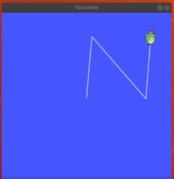

# ROS_Gazebo
 A project showcasing perception in robotics with ROS, Gazebo simulaor and OpenCV. It involves simulation for navigation, SLAM, object detection and tracking using turtlebot3 ROS package.
 
## Overview
The entire project has three sections-
1. [Intro to ROS](#-1-introduction-to-ros)
2. [World building in Gazebo simulator and robot interaction](#2-world-building-in-gazebo-simulator-and-robot-interaction-in-it)
3. SLAM, object detection and tracking

# 1 Introduction to ROS
The purpose of this assignment was to get acquainted with the fundamentals of ROS- how to create a ROS workspace, packages, topics, nodes, messages, publishing and subscribing messages.
The objective was to write a node that makes the turtlesim write the first letter of my last name which is ‘N’. First, I created a workspace and package 'nodes' within that workspace and then made a node ‘my_initials_turtlesim.py’ in that package. This node can be seen in the similar folder structure above. 

### Code Explanation
To make the turtlesim move, we publish messages to the ROS topic cmd_vel. For the rostopic of cmd_vel, the message type is geometry_msgs/Twist which expects two vectors (one for linear velocity and the other for angular velocity) with three float64 values each for the three axes. I initialized them to zero values and published the same to the topic.
 
The letter ‘N’ is represented by three edges. First, I turn the turtle by a specific angle by passing the angle value by which I want to move the turtle, to the z component of angular velocity vector. Since angular velocity is directly proportional to the angle (with respect to a fixed point), I simply publish the desired angle in radians to the topic cmd_vel. After moving the turtle at a desired angle, I had to move the turtle forward by a particular distance for making the edges of the letter ‘N’. To ensure both the parallel edges of letter ‘N’ are of the same length, I passed the linear velocity of value 1 to the x component of linear velocity vector and kept on publishing it till the turtle had moved by the specified distance. I calculated the distance using ‘Distance= Speed x (Current time- Initial time)’.
 
After publishing each desired angular and linear velocity, the program waits for 3 seconds with the help of the command ‘time.sleep(3)’ to ensure the turtle has completed moving with the published desired velocity value. After this, I have published 0 value to the cmd_vel to make sure the turtle moves only with the velocity value specified in the next publish command. 

I published just the z component of angular velocity for making the turtle take a turn as I wanted it to simply rotate about the point (i.e. about the z-axis if we imagine it coming out of the computer screen) it was on and not move in any other direction. Also, for linear velocity I published only the x component as the turtle was supposed to move only in the direction ahead (and it will be the x component as we rotate only about z axis from initial pose of the turtle and for every turn taken after that, so the turtle is always on the axes). 

The desired linear velocity and angular velocity values were specified in arrays, one for each vector and published the elements of both the arrays alternatively, first an element of angular velocity array (ang_z) and then an element of linear velocity array (vel_x). The elements of vel_x array were treated as distances to be moved.

### How to run

<p align="center">
  
</p>

In order to get the output as seen above, run the following two lines, each in a separate terminal tab/window-

```
rosrun turtlesim turtlesim_node
rosrun turtle_description my_initials_turtlesim.py
```
# 2 World building in Gazebo simulator and robot interaction in it
