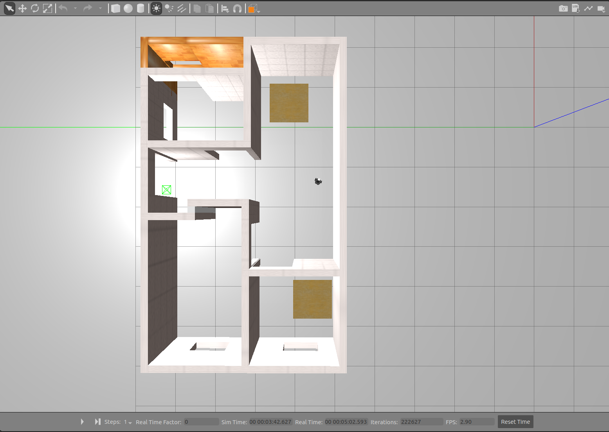
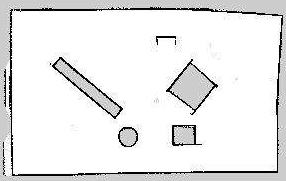

# ROS_Gazebo
 A project showcasing perception in robotics with ROS, Gazebo simulator and OpenCV. It involves simulation for navigation, SLAM, object detection and tracking using turtlebot3 ROS package.
 
## Dependencies
* Ubuntu 
* ROS Melodic
* Gazebo (gazebo_ros_pkgs)
* [turtlebot3 package](https://github.com/ROBOTIS-GIT/turtlebot3)
* [slam_gmapping package](https://github.com/ros-perception/slam_gmapping)
* [turtlebot3_simulations package](https://github.com/ROBOTIS-GIT/turtlebot3_simulations)
* [turtlebot3_msgs](https://github.com/ROBOTIS-GIT/turtlebot3_msgs)
* [openslam_gmapping package](https://github.com/ros-perception/openslam_gmapping)
* [navigation package](https://github.com/ros-planning/navigation)
* [vision_opencv](https://github.com/ros-perception/vision_opencv/tree/melodic)
* [darkflow](https://github.com/thtrieu/darkflow)
* TensorFlow 1.x

Tested on
* Ubuntu 18.04.4 LTS, ROS Melodic
 
## Deployment Overview
The entire project has three sections-
1. [Introduction to ROS](#1-introduction-to-ros)
2. [World building in Gazebo and robot interaction in it](#2-world-building-in-gazebo-and-robot-interaction-in-it)
3. [SLAM, object detection and tracking](#3-slam-object-detection-and-tracking)

## 1. Introduction to ROS
The purpose of this assignment was to get acquainted with the fundamentals of ROS- how to create a ROS workspace, packages, topics, nodes, messages, publishing and subscribing messages.

The objective was to write a node that makes the turtlesim write the first letter of my last name which is ‘N’. First, I created a workspace and package 'nodes' within that workspace and then made a node ‘my_initials_turtlesim.py’ in that package. This node can be seen in the similar folder structure above- ./nodes/my_initials_turtlesim.py 

### Node code explanation
To make the turtlesim move, we publish messages to the ROS topic cmd_vel. For the rostopic of cmd_vel, the message type is geometry_msgs/Twist which expects two vectors (one for linear velocity and the other for angular velocity) with three float64 values each for the three axes. I initialized them to zero values and published the same to the topic.
 
The letter ‘N’ is represented by three edges. First, I turn the turtle by a specific angle by passing the angle value by which I want to move the turtle, to the z component of angular velocity vector. Since angular velocity is directly proportional to the angle (with respect to a fixed point), I simply publish the desired angle in radians to the topic cmd_vel. After moving the turtle at a desired angle, I had to move the turtle forward by a particular distance for making the edges of the letter ‘N’. To ensure both the parallel edges of letter ‘N’ are of the same length, I passed the linear velocity of value 1 to the x component of linear velocity vector and kept on publishing it till the turtle had moved by the specified distance. I calculated the distance using ‘Distance= Speed x (Current time - Initial time)’.
 
After publishing each desired angular and linear velocity, the program waits for 3 seconds with the help of the command ‘time.sleep(3)’ to ensure the turtle has completed moving with the published desired velocity value. After this, I have published 0 value to the cmd_vel to make sure the turtle moves only with the velocity value specified in the next publish command. 

I published just the z component of angular velocity for making the turtle take a turn as I wanted it to simply rotate about the point (i.e. about the z-axis if we imagine it coming out of the computer screen) it was on and not move in any other direction. Also, for linear velocity I published only the x component as the turtle was supposed to move only in the direction ahead (and it will be the x component as we rotate only about z axis from initial pose of the turtle and for every turn taken after that, so the turtle is always on the axes). 

The desired linear velocity and angular velocity values were specified in arrays, one for each vector and published the elements of both the arrays alternatively, first an element of angular velocity array (ang_z) and then an element of linear velocity array (vel_x). The elements of vel_x array were treated as distances to be moved.

### How to run

<p align="center">
  
</p>

In order to get the output as seen above, run the following two lines, each in a separate Ubuntu terminal tab/window-

```
rosrun turtlesim turtlesim_node
rosrun turtle_description my_initials_turtlesim.py
```
## 2. World building in Gazebo and robot interaction in it
The purpose of this project was to understand and use ROS Gazebo simulator along with making a robot interact in a Gazebo world. 

The objective was to make a Gazebo world with a Turtlebot3 robot in it and teleoperate the robot to move to make the shape of letter ‘N’ in the world space built.

The world which is a house-like structure was built with the help of the following Gazebo tutorials-
1.	Building a world- http://gazebosim.org/tutorials?tut=build_world&cat=build_world
2.	Building Editor- http://gazebosim.org/tutorials?tut=building_editor&cat=build_world

Some views of the house structure I built in Gazebo simulator are as seen below-

<p align="center">
  
</p>
<p align="center">
  
</p>
<p align="center">
  
</p>

Steps implemented to make the world with house structure are-
1. A picture of a floorplan of consisting of 3 rooms was imported in the 2D view of the building editor. 
2. Using the wall option from the palette, the outline of the floorplan was traced over to generate a structure with the walls in the 3D view. 
3. Next, the doors and windows were added to the structure according to their placings in the 2D floorplan image along with two café tables as obstacles. 
4. Lastly, the walls material and colour were changed. 
5. We saved the created model of a house as a .sdf file in the turtle_gazebo package that was created for this project. 

### Process explanation

The turtlebot3 robot supposed to be launched in the house world built is part of the turtlebot3 package which can be found at- https://github.com/ROBOTIS-GIT/turtlebot3. More details about the package can be found at- http://wiki.ros.org/turtlebot3. 

The house with the turtlebot3 in it is as seen below-
<p align="center">
  
</p>

The ‘turtle_gazebo’ package created in this project consists of the world file in the worlds folder; the world file contains the house model that we created using building editor along with the default sun and the ground plane models. 

This world file was referenced in the launch file ‘turtle_world’ which was to be launched in an empty world. The launch file also contains a robot spawn method which uses a small python script called spawn model to make a service call request to the gaebo_ros ROS node (named simply "gazebo" in the rostopic namespace) to add a custom URDF into Gazebo which in our case is the turtlebot3 model with a camera attached to the ‘base_scan’ link of the turtlebot3 robot model. 

The camera is not attached by default to the turtlebot3. The code to add a camera to the turtlebot3 was added in the ‘turtlebot3_burger.urdf.xacro’ file. The code to capture images from the camera was added in the ‘turtlebot3_burger.gazebo.xacro’ file. Both of these xacro files are in the ‘turtlebot3_description’ package within the turtlebot3 package referenced above. The reference used for adding a camera and capturing images is- http://gazebosim.org/tutorials?tut=ros_gzplugins

For running the entire simulation, the launch file is executed which initiates the gazebo environment with the house and the turtlebot3 in it. Then we launch the rviz environment to see the view from the turtlebot3’s perspective. We run the node path.py present in the turtle_description package. In the rviz environment we add a path.py node to the topic ‘Path’ to trace the trajectory of the turtlebot3 as it moved around the house and made the letter ‘N’ in the end. Lastly we run the node ‘my_initials.py’ so that turtlebot3 starts traversing around the house and the letter ‘N’.

### How to run

In order to get the output as per the objective, run the following lines in Ubuntu terminal tabs/windows-
```
export GAZEBO_MODEL_PATH=${GAZEBO_MODEL_PATH}:~/catkin_ws/src/turtle_gazebo/models:~/catkin_ws/src/turtle_gazebo/worlds 
export GAZEBO_MODEL_PATH=${GAZEBO_MODEL_PATH}:~/catkin_ws/src/turtlebot3_simulations/turtlebot3_gazebo/models:~/catkin_ws/src/turtlebot3_simulations/turtlebot3_gazebo/worlds 
export TURTLEBOT3_MODEL=burger 
roslaunch turtle_gazebo turtle_world.launch 
In new terminal- roslaunch turtlebot3_gazebo turtlebot3_gazebo_rviz.launch 
In new terminal- rosrun turtle_description my_initials.py 
In new terminal- rosrun turtle_description path.py 
```
The turtlebot3 moving around the house in Gazebo simulator along with turtlebot3 camera perspective in rviz can be seen below-
<p align="center">
  
</p>

The path traversed by the turtlebot3 in the Gazebo house world as observed in rviz can be seen below-
<p align="center">
  
</p>

## 3. SLAM, object detection and tracking

The purpose of this project was to learn to use SLAM using the gmapping package in ROS to create maps of the simulated world and use these maps for navigation tasks as well as to avoid obstacles during navigation. 

The objective was to assist navigation for both pursuer and evader with the help of the map created using SLAM. Turtlebot3 acts as a Pursuer and the human model as an Evader. A node was created for tracking the evader and then use the bounding box, localization information to send goals to the pursuer to track the evader.

### SLAM

First, we create a map of the world using SLAM and turtlebot3.

#### Process explanation

The slam_gmapping package can be found at- https://github.com/ros-perception/slam_gmapping with more details at- http://wiki.ros.org/gmapping.

The Gazebo simulator with a world and a gmapping node to start the process of creating a map was first initiated using a launch file provided by Professor Duo and can be found in the 'pursuit_evasion' package. This is followed by using the 'turtlebot3_teleop package' which allows the teleoperating the turtlebot3 using the keyboard to move the turtlebot3 around the Gazebo world to create a map of that world space. At the same time, this process is visualized in rviz in real-time to see how much of the world has already been mapped by the turtlebot3 and end teleoperating the robot when it is done mapping the whole world space. After this, we save the map created using the 'map_server' package. This process is referenced from- https://github.com/ROBOTIS-GIT/emanual/blob/master/docs/en/platform/turtlebot3/simulation.md#virtual-slam-with-turtlebot3.

#### How to run

The step-by-step commands for this process in Ubuntu terminal tab/window are-
```
roslaunch pursuit_evasion robot_mapping.launch world_index:=0 gui:=true
roslaunch turtlebot3_teleop turtlebot3_teleop_key.launch
rosrun map_server map_saver -f
```
The turtlebot3 creating a map of the Gazebo world using SLAM can be seen below-
<p align="center">
  
</p>

The map created is shown in the figure below-
<p align="center">
  
</p>
The black borders in the figure represent the boundaries of the obstacle as detecting by the SLAM process. 

### Autonomous navigation 

After the map is created, turtlebot3 can use it to move around the world autonomously.

#### Process explanation
The " turtlebot3_navigation " package provides an abstract way to load the map you created above and to use it with the " move_base " package which is a part of the ROS navigation stack to navigate in the known environment (the map created previously) by sending goal locations (using the ‘2D Nav Goal’ button in RViz) to turtlebot3 using RViz. This step helped me in understanding how the navigation stack works and how to autonomously move in a known map while avoiding obstacles. 

The reference used for this process is- https://github.com/ROBOTIS-GIT/emanual/blob/master/docs/en/platform/turtlebot3/simulation.md#virtual-navigation-with-turtlebot3. The move_base package can be found at- https://github.com/ros-planning/navigation with more details at- http://wiki.ros.org/move_base.

First, we launch the world file and then load the map created previously using the turtlebot3_navigation package which opens a rviz window. In the rviz window goals are provided for the turtlebot3 to navigate in the world while avoiding obstacles. 

#### How to run

The steps for this process in Ubuntu terminal tab/window are-
```
roslaunch pursuit_evasion sim.launch world_index:=0 gui:=true
roslaunch turtlebot3_navigation turtlebot3_navigation.launch map_file:= path/to/map.yaml
```

The turtlebot3 can be seen navigating autonomously in the Gazebo world as well as as SLAM visualization of the same in the rviz window below-
<p align="center">
  
</p>

### Object detection and tracking

Once, the turtlebot3 can move autonomously around the world, the next task is to make the turtlebot3 detect the person in the Gazebo world and track it continuously.

#### Process explanation

A world file provided by Professor Duo (with turtlebot3 and a human model) is launched along with the map created earlier. The task is for the turtlebot3 to detect and track the human using the camera attached previously on turtlebot3. In order to do so, firstly, a node is created which subscribes to the image topic of the turtlebot3 camera. But ROS produces image messages of the form ‘sensor_msgs/Image’ which are not compatible with OpenCV. The cv_bridge package helps in converting the ROS image messages to OpenCV image representation which can used for perception. 

The image converted by ‘cv_bridge’ is used to detect and track the person model if present in the image. 
The algorithm here used for object detection is YOLOv2. The YOLOv2 weights were downloaded from https://pjreddie.com/media/files/yolov2.weights. Darkflow framework (https://github.com/thtrieu/darkflow) is used for executing YOLOv2 which is a Tensorflow version of Darknet. Once the image taken from the turtlebot3 camera is converted to the required form using cv_bridge, it is then passed into tfnet.return_predict() in the form of a numpy array which returns what kind of object is detected by the turtlebot.
YOLO takes entire image in a single instance and predicts the bounding box coordinates(top_x,top_y,btm_x,btm_y) and class probabilities for these boxes. The frames detected are shown in the pictures below-

<p align="center">
  
</p>
<p align="center">
  
</p>

The evader is tracked using bounding box values of the evader detected by the YOLO. The center along horizontal axis (i.e. orientation in z-direction) of the bounding box created in the image captured by the turtlebot3 camera is used as reference to move turtle bot left or right. PoseStamped messages to the pursuer (turtlebot3) topic '/tb3_0/move_base_simple/goal' are published as goals to move it in a particular direction. A 20-pixel threshold range is used for the same. The turtlebot3 turns left whenever it detects any value lesser than this range and turns right when it detects any value greater than this range (As the origin of image frame is at top left corner). The center along vertical axis of the bounding box of the detected person cannot be used as this only tells how far the subject is but not the direction and the reference frames of the environment measurements and the image captured by the turtle bot are different. So, the distances in the directions from the image world to the environment cannot be mapped. 

#### How to run

The steps for this process in Ubuntu terminal tab/window are-
```
roslaunch pursuit_evasion robot_amcl.launch map_file:= /home/malaynagda/catkin_ws/src/pursuit_evasion/maps/map.yaml world_index:=0
rosrun turtle_description rostocv.py
roslaunch pursuit_evasion move_evader.launch world_index:=0
```

The turtlebot3(pursuer) can be seen tracking the human(evader) below-
<p align="center">
  
</p>

## Authors
* Malay Nagda- Introduction to ROS, World building in Gazebo and robot interaction in it, SLAM, object detection and tracking
* Anusha Vaidya- World building in Gazebo and robot interaction in it
* Karthik Kashinath Kulkarni- World building in Gazebo and robot interaction in it

## Acknowledgements
This project was a part of a graduate course at Arizona Sate University- Perception in Robotics as taught and resources provided by Dr. Yezhou Yang and Duo Lu. 
